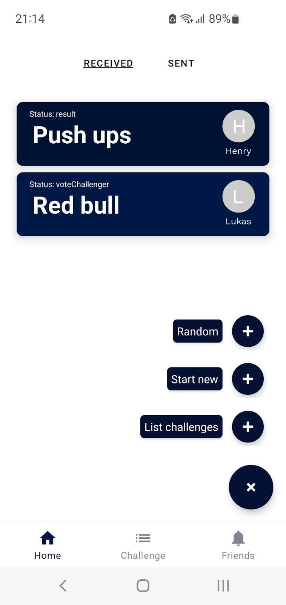
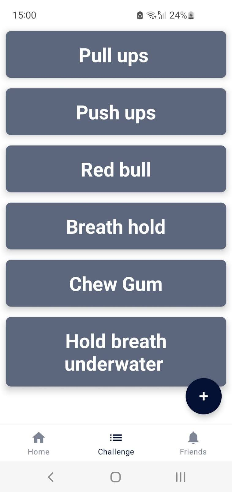
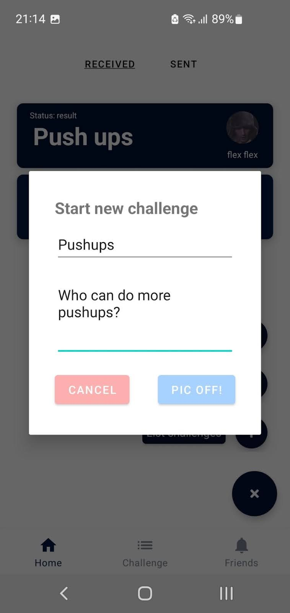
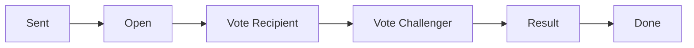

<div align="center">
  <h1>📸 Pic Off</h1>

  <p>
    <strong>Social Photo Challenge App for Android</strong>
  </p>

  <p>
    <a href="https://kotlinlang.org/"></a>
    <a href="https://developer.android.com/"></a>
    <a href="https://firebase.google.com/"></a>
    <a href="https://opensource.org/licenses/MIT"></a>
  </p>
</div>

## 💡 About

**Pic Off** makes photo challenges fun and effortless. Built natively with **Kotlin**, it allows users to challenge friends to take the best picture based on a specific theme.

The goal was to engineer a robust **Single-Activity application** utilizing **MVVM architecture** to handle complex state transitions seamlessly.

---

## 📱 Screenshots

| Home & Feed | Challenges | Start New Challenge |
|:-----------:|:----------------:|:----------------:|
|  |  |  |
---

## 🛠 Tech Stack

* **Architecture:** MVVM, Single Activity (Navigation Component), ViewBinding
* **Core:** Kotlin, Coroutines, LiveData
* **Backend (Firebase):** Auth (Google Sign-In), Realtime Database, Storage
* **Key Features:** AlarmManager (Resilient Notifications), Camera Intents, Offline Support

---

## 🔄 Challenge State Logic

Managing the lifecycle of a challenge between two users is handled via a state machine in the `MainViewModel`:



1. **Sent:** Challenger sends request.
2. **Open:** Recipient accepts and uploads photo.
3. **Vote Recipient:** Recipient votes.
4. **Vote Challenger:** Challenger votes.
5. **Result:** Winner is calculated and displayed.
6. **Done:** Challenge completed.

---

## 📥 Installation

1. **Clone the repo**
   ```bash
   git clone https://github.com/libaum/PicOff.git
   ```

2. **Firebase Setup**
   * Add your own `google-services.json` to the `/app` directory.

3. **Build**
   * Open in **Android Studio** (Electric Eel+) and run (minSdk 26).

---

<p align="center">
    Built with ❤️ and Kotlin for Android
</p>